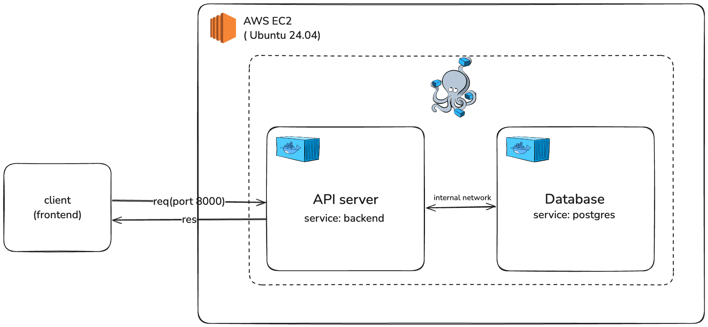

# hair-chart-api
api service for hair chart project

## design

### dev env
This project deploys a FastAPI server and a PostgreSQL database on an AWS EC2 (Ubuntu 24.04) instance using Docker Compose.

- design

    

- Ports

    | Component       | Port   | Exposed To      |
    | --------------- | ------ | --------------- |
    | FastAPI Backend | `8000` | Public (Client) |
    | PostgreSQL DB   | `5432` | Internal Only   |

### prod env (WIP)

For production use, consider:
- Using Amazon RDS for database
- Exposing API behind Nginx or a reverse proxy
- Adding HTTPS termination via Let's Encrypt or AWS ACM

## setting

### .env
- for dev environment
    ```
    POSTGRES_USER=
    POSTGRES_PASSWORD=
    POSTGRES_DB=
    ```
- for prod environment
    
    wip

## run api server
- local
    ```
    uvicorn main:app --reload
    ```

- with docker
    ```
    docker compose down -v 
    docker compose up --build
    ```
